# Projet Kubernetes — 5SDWANA
## POC Kubernetes pour un client e-commerce

**Date** : 25/03/2026  
**Équipe** : Clément GRECO & Vincent  
**Convention de nommage** : `cv-25-03-2026`  
**Repository GitHub** : [https://github.com/ClementGRC/projet-k8s-CV-25-03-2026](https://github.com/ClementGRC/projet-k8s-CV-25-03-2026)  
**Registry Docker Hub** : [https://hub.docker.com/u/clemgrc](https://hub.docker.com/u/clemgrc)

---

## Table des matières

1. [Contexte du projet](#1-contexte-du-projet)
2. [Architecture globale](#2-architecture-globale)
3. [Choix techniques et justifications](#3-choix-techniques-et-justifications)
4. [Étape 1 — Initialisation du projet et Git](#4-étape-1--initialisation-du-projet-et-git)
5. [Étape 2 — Installation et configuration de Minikube](#5-étape-2--installation-et-configuration-de-minikube)
6. [Étape 3 — Création des namespaces](#6-étape-3--création-des-namespaces)
7. [Étape 4 — Analyse et optimisation des applications](#7-étape-4--analyse-et-optimisation-des-applications)
8. [Étape 5 — Build des images Docker optimisées](#8-étape-5--build-des-images-docker-optimisées)
9. [Étape 6 — Publication sur Docker Hub](#9-étape-6--publication-sur-docker-hub)
10. [Étape 7 — Déploiement en environnement dev](#10-étape-7--déploiement-en-environnement-dev)
11. [Étape 8 — Déploiement en environnement preprod](#11-étape-8--déploiement-en-environnement-preprod)
12. [Étape 9 — Déploiement en environnement prod](#12-étape-9--déploiement-en-environnement-prod)
13. [Étape 10 — Test de paiement Stripe](#13-étape-10--test-de-paiement-stripe)
14. [Étape 11 — Rollout et Rollback](#14-étape-11--rollout-et-rollback)
15. [Étape 12 — Infrastructure as Code avec Kustomize](#15-étape-12--infrastructure-as-code-avec-kustomize)
16. [Étape 13 — Collecte des logs](#16-étape-13--collecte-des-logs)
17. [Gestion des secrets et sécurité](#17-gestion-des-secrets-et-sécurité)
18. [Avantages et inconvénients des solutions choisies](#18-avantages-et-inconvénients-des-solutions-choisies)
19. [Problèmes rencontrés et solutions](#19-problèmes-rencontrés-et-solutions)
20. [Conclusion](#20-conclusion)

---

## 1. Contexte du projet

Dans le cadre de la formation 5SDWANA, nous avons intégré le rôle d'une équipe SRE dans un grand groupe français. Le scrum master nous demande de déployer 3 applications conteneurisées pour un nouveau client e-commerce qui doit gérer plusieurs milliers de clients connectés en simultané.

Le client souhaite un POC basé sur Kubernetes. L'une des 3 applications doit obligatoirement intégrer la passerelle de paiement Stripe pour réaliser des tests de paiement.

**Contraintes du sujet :**

- 3 applications conteneurisées, dont une obligatoirement avec Stripe
- Applications les plus légères possible
- 3 réplicas par application
- Applications accessibles depuis l'extérieur
- Images disponibles depuis un registry d'image (Docker Hub)
- 3 environnements : dev, preprod, prod
- Autoscaling (HPA) sur preprod et prod
- Système de mise à jour (rollout) et de retour en arrière (rollback)
- Tout déployé de façon "as code" via des manifests YAML
- Repo Git avec commits réguliers et messages explicites
- Infrastructure as code : un fichier par application

---

## 2. Architecture globale

```
                        ┌─────────────────────────────────────────────┐
                        │            Cluster Minikube                 │
                        │         (1 node, 6 Go RAM, 2 CPUs)         │
                        │                                             │
                        │  ┌───────────┐ ┌───────────┐ ┌───────────┐ │
                        │  │ Namespace │ │ Namespace │ │ Namespace │ │
                        │  │    dev    │ │  preprod  │ │   prod    │ │
                        │  │           │ │           │ │           │ │
                        │  │ ┌───────┐ │ │ ┌───────┐ │ │ ┌───────┐ │ │
                        │  │ │Ecomm. │ │ │ │Ecomm. │ │ │ │Ecomm. │ │ │
                        │  │ │x3 rep.│ │ │ │x3 rep.│ │ │ │x3 rep.│ │ │
                        │  │ │+Stripe│ │ │ │+Stripe│ │ │ │+Stripe│ │ │
                        │  │ └───────┘ │ │ │+ HPA  │ │ │ │+ HPA  │ │ │
                        │  │ ┌───────┐ │ │ └───────┘ │ │ └───────┘ │ │
                        │  │ │Django │ │ │ ┌───────┐ │ │ ┌───────┐ │ │
                        │  │ │Pro    │ │ │ │Django │ │ │ │Django │ │ │
                        │  │ │x3 rep.│ │ │ │Pro    │ │ │ │Pro    │ │ │
                        │  │ └───────┘ │ │ │x3+HPA│ │ │ │x3+HPA│ │ │
                        │  │ ┌───────┐ │ │ └───────┘ │ │ └───────┘ │ │
                        │  │ │Dashb. │ │ │ ┌───────┐ │ │ ┌───────┐ │ │
                        │  │ │x3 rep.│ │ │ │Dashb. │ │ │ │Dashb. │ │ │
                        │  │ └───────┘ │ │ │x3+HPA│ │ │ │x3+HPA│ │ │
                        │  │           │ │ └───────┘ │ │ └───────┘ │ │
                        │  │ NodePort  │ │ LoadBal.  │ │ LoadBal.  │ │
                        │  └───────────┘ └───────────┘ └───────────┘ │
                        │                                             │
                        │  27 pods total (3 apps × 3 replicas × 3 envs)│
                        │                                             │
                        │  Images : Docker Hub (clemgrc/)             │
                        └─────────────────────────────────────────────┘
```

**Par application, chaque environnement contient :**

- 1 ConfigMap (variables d'environnement non sensibles)
- 1 Secret (clés Stripe, secrets applicatifs)
- 1 Deployment (avec 3 réplicas)
- 1 Service (NodePort en dev, LoadBalancer en preprod/prod)
- 1 HPA (preprod et prod uniquement, min 3 → max 10 pods, seuil CPU 50%)

---

## 3. Choix techniques et justifications

### 3.1 Orchestrateur : Minikube

Minikube a été choisi comme solution locale pour ce POC car il permet de simuler un cluster Kubernetes complet sur un seul nœud. Il est léger, facile à installer, et supporte tous les composants k8s nécessaires.

**Driver utilisé** : Docker, recommandé pour les environnements Linux virtualisés.

### 3.2 Applications

Les 3 applications proviennent des templates AppSeed fournis par le formateur :

| Application | Framework | Port | Rôle | Image Docker Hub |
|---|---|---|---|---|
| Rocket Ecommerce | Django + Stripe | 5005 | E-commerce avec paiement | `clemgrc/ecommerce-stripe-cv:1.0` |
| Rocket Django Pro | Django | 5005 | Application secondaire | `clemgrc/django-pro-cv:1.0` |
| Soft UI Dashboard | Django | 5005 | Dashboard d'administration | `clemgrc/dashboard-cv:1.0` |

### 3.3 Optimisation des images Docker

Le sujet exigeant des applications "les plus légères possible", nous avons appliqué plusieurs optimisations :

| Optimisation | Description | Impact |
|---|---|---|
| Multi-stage build | Stage 1 (Node.js) compile le frontend, Stage 2 (Python slim) ne contient que le runtime | Suppression de Node.js/npm de l'image finale |
| `python:3.11-slim` | Image de base minimaliste (~150 Mo vs ~900 Mo pour l'image full) | Réduction de ~80% de la taille de base |
| `.dockerignore` | Exclusion de `.git`, `node_modules`, `__pycache__`, `.env`, etc. | Réduction du build context |
| `--no-cache-dir` pip | Pas de cache pip stocké dans l'image | Réduction de ~50 Mo par image |
| Layers combinées | `RUN` multiples regroupés avec `&&` | Réduction du nombre de layers |

**Résultats :**

| Image | Taille optimisée | Estimée sans optimisation | Réduction |
|---|---|---|---|
| `clemgrc/ecommerce-stripe-cv:1.0` | **256 Mo** | ~1.5 Go | **~83%** |
| `clemgrc/django-pro-cv:1.0` | **428 Mo** | ~1.5 Go | **~71%** |
| `clemgrc/dashboard-cv:1.0` | **284 Mo** | ~1.2 Go | **~76%** |

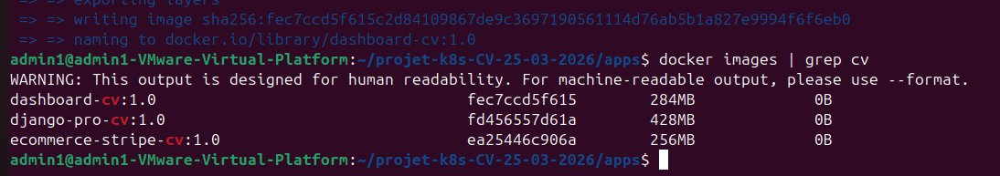

### 3.4 Stratégie de Services par environnement

| Environnement | Type de Service | Justification |
|---|---|---|
| Dev | NodePort | Simple, suffisant pour les tests locaux |
| Preprod | LoadBalancer | Simule la production avec équilibrage de charge |
| Prod | LoadBalancer | Standard en production pour l'accès externe |

### 3.5 Registry : Docker Hub

Les images sont hébergées sur Docker Hub sous le compte `clemgrc`, conformément à l'exigence du sujet. Les manifests Kubernetes référencent directement les images du registry avec `imagePullPolicy: IfNotPresent` (vérifie en local d'abord, pull depuis Docker Hub si absent).

### 3.6 Infrastructure as Code : Kustomize

Kustomize est intégré nativement dans kubectl. Il permet de définir une base commune de manifests et des overlays par environnement ne contenant que les différences, éliminant la duplication.

### 3.7 Gestion des secrets

Les secrets (clés Stripe) sont gérés via des objets Kubernetes `Secret` de type `Opaque`, exclus du dépôt Git via `.gitignore`.

---

## 4. Étape 1 — Initialisation du projet et Git

### 4.1 Création de la structure

```bash
mkdir projet-k8s-CV-25-03-2026
cd projet-k8s-CV-25-03-2026
git init
git config --global user.name "ClementGRC"
git config --global user.email "greco.clement57@gmail.com"
```

**Structure finale du projet :**

```
projet-k8s-CV-25-03-2026/
├── README.md
├── .gitignore
├── apps/
│   ├── priv-rocket-ecommerce-main/
│   ├── priv-rocket-django-pro-main/
│   └── priv-django-soft-ui-dashboard-pro-master/
├── manifests/
│   ├── namespaces.yaml
│   ├── dev/
│   ├── preprod/
│   └── prod/
├── infra/
│   ├── ecommerce/  (base + overlays Kustomize)
│   ├── django-pro/ (base + overlays Kustomize)
│   └── dashboard/  (base + overlays Kustomize)
├── docs/
└── logs/
```

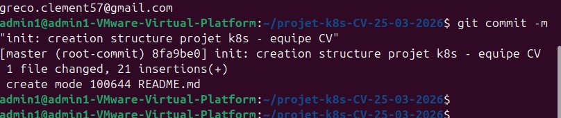

### 4.2 Push vers GitHub

```bash
git remote add origin https://github.com/ClementGRC/projet-k8s-CV-25-03-2026.git
git branch -M main
git push -u origin main
```

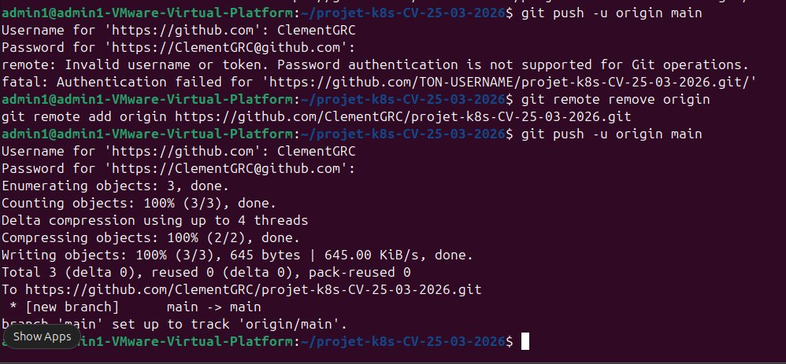

---

## 5. Étape 2 — Installation et configuration de Minikube

```bash
minikube version   # v1.38.1
docker --version   # Docker 29.3.0
minikube start --driver=docker --memory=6144 --cpus=2
minikube addons enable metrics-server
```

La VM a été configurée à 8 Go de RAM avec 6 Go alloués à Minikube pour supporter les 27 pods.

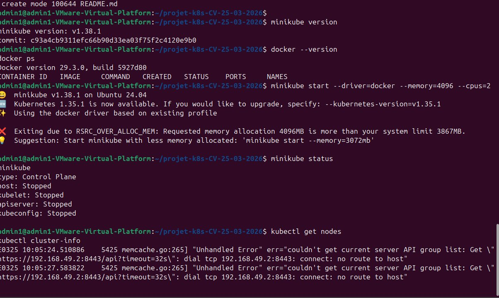

---

## 6. Étape 3 — Création des namespaces

```yaml
apiVersion: v1
kind: Namespace
metadata:
  name: dev
  labels:
    env: dev
---
apiVersion: v1
kind: Namespace
metadata:
  name: preprod
  labels:
    env: preprod
---
apiVersion: v1
kind: Namespace
metadata:
  name: prod
  labels:
    env: prod
```

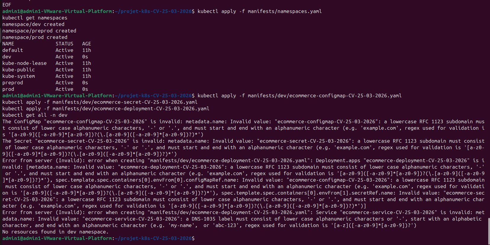

---

## 7. Étape 4 — Analyse et optimisation des applications

### 7.1 Analyse

Les 3 applications fournies contenaient chacune un Dockerfile et un `requirements.txt`. Toutes utilisent le port 5005 via Gunicorn.

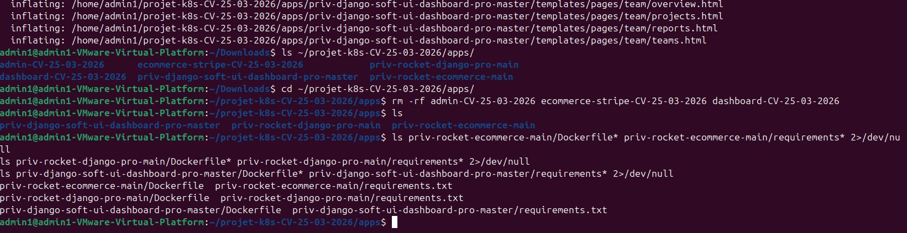
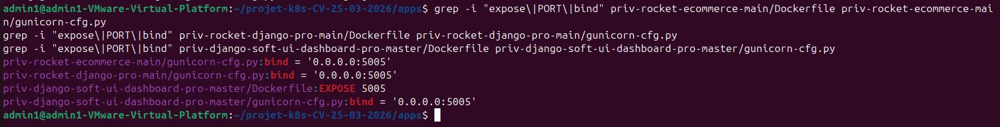
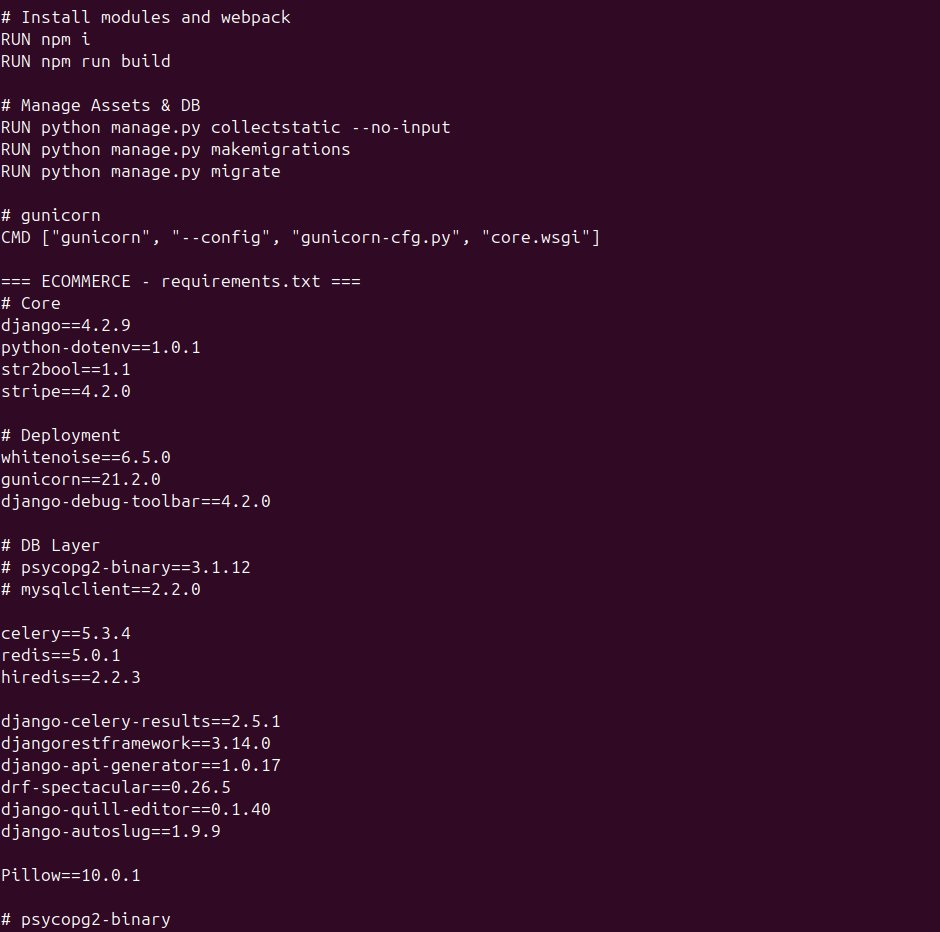

### 7.2 Dockerfiles optimisés

**Ecommerce et Django Pro — Multi-stage build :**

```dockerfile
# Stage 1 : Build frontend
FROM node:18-slim AS frontend
WORKDIR /app
COPY package*.json ./
RUN npm i
COPY . .
RUN npm run build

# Stage 2 : Image production
FROM python:3.11-slim
ENV PYTHONDONTWRITEBYTECODE=1
ENV PYTHONUNBUFFERED=1
WORKDIR /app
COPY requirements.txt .
RUN pip install --upgrade pip && pip install --no-cache-dir -r requirements.txt
COPY . .
COPY --from=frontend /app/static /app/static
RUN python manage.py collectstatic --no-input && \
    python manage.py makemigrations && python manage.py migrate
EXPOSE 5005
CMD ["gunicorn", "--config", "gunicorn-cfg.py", "core.wsgi"]
```

**Dashboard — Image simple :**

```dockerfile
FROM python:3.10-slim
ENV PYTHONDONTWRITEBYTECODE=1
ENV PYTHONUNBUFFERED=1
WORKDIR /app
COPY requirements.txt .
RUN pip install --upgrade pip && pip install --no-cache-dir -r requirements.txt
COPY . .
RUN python manage.py collectstatic --no-input && \
    python manage.py makemigrations && python manage.py migrate
EXPOSE 5005
CMD ["gunicorn", "--config", "gunicorn-cfg.py", "core.wsgi"]
```

---

## 8. Étape 5 — Build des images Docker optimisées

```bash
eval $(minikube docker-env)
docker build -t ecommerce-stripe-cv:1.0 priv-rocket-ecommerce-main/
docker build -t django-pro-cv:1.0 priv-rocket-django-pro-main/
docker build -t dashboard-cv:1.0 priv-django-soft-ui-dashboard-pro-master/
```

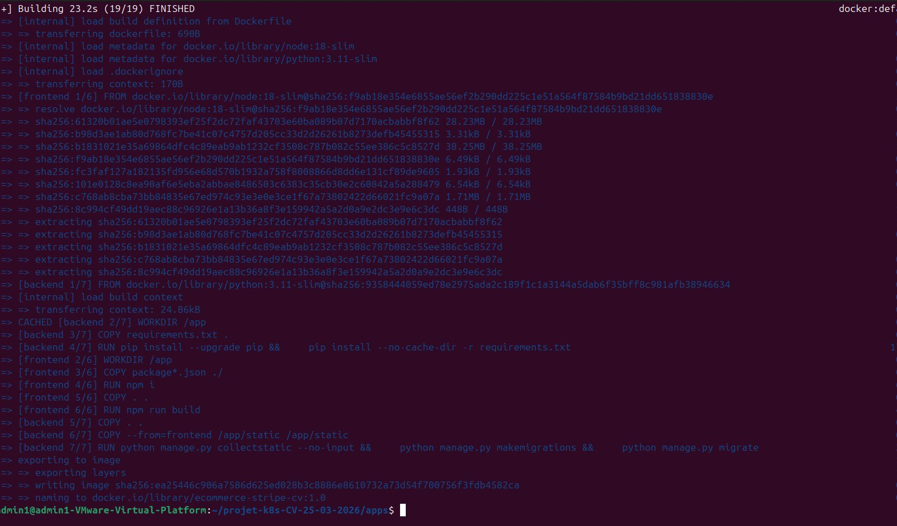


**Total** : ~968 Mo au lieu de ~4.2 Go, soit une **réduction de ~77%**.

---

## 9. Étape 6 — Publication sur Docker Hub

Le sujet exige que les images soient accessibles depuis un registry. Les 3 images ont été poussées sur Docker Hub.

### 9.1 Tag et push

```bash
docker login -u clemgrc

docker tag ecommerce-stripe-cv:1.0 clemgrc/ecommerce-stripe-cv:1.0
docker tag django-pro-cv:1.0 clemgrc/django-pro-cv:1.0
docker tag dashboard-cv:1.0 clemgrc/dashboard-cv:1.0

docker push clemgrc/ecommerce-stripe-cv:1.0
docker push clemgrc/django-pro-cv:1.0
docker push clemgrc/dashboard-cv:1.0
```

### 9.2 Mise à jour des manifests

Tous les manifests Kubernetes ont été mis à jour pour référencer les images du registry :

```yaml
# Avant
image: ecommerce-stripe-cv:1.0
imagePullPolicy: Never

# Après
image: clemgrc/ecommerce-stripe-cv:1.0
imagePullPolicy: IfNotPresent
```

`IfNotPresent` : Kubernetes vérifie d'abord si l'image existe en local, sinon la télécharge depuis Docker Hub. C'est le comportement standard en production.

### 9.3 Images disponibles sur Docker Hub

Les 3 images sont accessibles publiquement sur : [https://hub.docker.com/u/clemgrc](https://hub.docker.com/u/clemgrc)

| Image | URL Docker Hub |
|---|---|
| E-commerce Stripe | `clemgrc/ecommerce-stripe-cv:1.0` |
| Django Pro | `clemgrc/django-pro-cv:1.0` |
| Dashboard | `clemgrc/dashboard-cv:1.0` |

---

## 10. Étape 7 — Déploiement en environnement dev

### Manifest exemple — Ecommerce

```yaml
apiVersion: apps/v1
kind: Deployment
metadata:
  name: ecommerce-deployment-cv
  namespace: dev
  labels:
    app: ecommerce
    env: dev
spec:
  replicas: 3
  selector:
    matchLabels:
      app: ecommerce
  template:
    metadata:
      labels:
        app: ecommerce
        env: dev
    spec:
      containers:
        - name: ecommerce-stripe
          image: clemgrc/ecommerce-stripe-cv:1.0
          imagePullPolicy: IfNotPresent
          ports:
            - containerPort: 5005
          envFrom:
            - configMapRef:
                name: ecommerce-configmap-cv
            - secretRef:
                name: ecommerce-secret-cv
          resources:
            requests:
              memory: "128Mi"
              cpu: "50m"
            limits:
              memory: "512Mi"
              cpu: "500m"
```

### Résultat : 9 pods Running

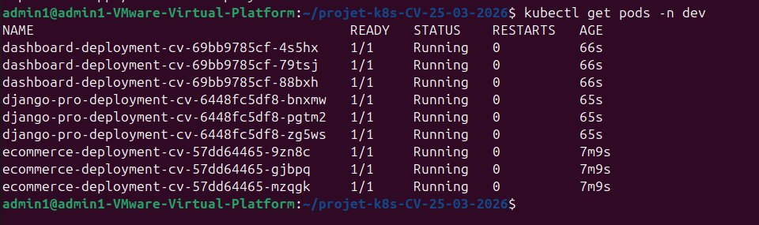

### Accès depuis le navigateur

```bash
kubectl port-forward -n dev service/ecommerce-service-cv 5005:5005 --address 0.0.0.0
kubectl port-forward -n dev service/django-pro-service-cv 5006:5005 --address 0.0.0.0
kubectl port-forward -n dev service/dashboard-service-cv 5007:5005 --address 0.0.0.0
```

| App | URL d'accès |
|---|---|
| Ecommerce Stripe | `http://192.168.52.128:5005` |
| Django Pro | `http://192.168.52.128:5006` |
| Dashboard | `http://192.168.52.128:5007` |


---

## 11. Étape 8 — Déploiement en environnement preprod

### Différences avec dev

| Paramètre | Dev | Preprod |
|---|---|---|
| DEBUG | True | **False** |
| Service | NodePort | **LoadBalancer** |
| HPA | Non | **Oui (min 3, max 10, CPU 50%)** |

### HPA manifest

```yaml
apiVersion: autoscaling/v2
kind: HorizontalPodAutoscaler
metadata:
  name: ecommerce-hpa-cv
  namespace: preprod
spec:
  scaleTargetRef:
    apiVersion: apps/v1
    kind: Deployment
    name: ecommerce-deployment-cv
  minReplicas: 3
  maxReplicas: 10
  metrics:
    - type: Resource
      resource:
        name: cpu
        target:
          type: Utilization
          averageUtilization: 50
  behavior:
    scaleDown:
      stabilizationWindowSeconds: 60
```

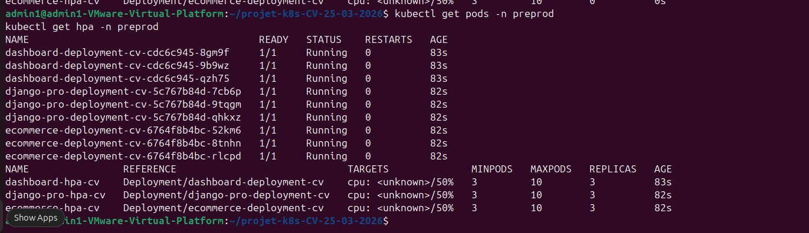

---

## 12. Étape 9 — Déploiement en environnement prod

Identique à la preprod. Manifests dupliqués et adaptés :

```bash
cp manifests/preprod/*.yaml manifests/prod/
sed -i 's/preprod/prod/g' manifests/prod/*.yaml
kubectl apply -f manifests/prod/
```

### 27 pods Running

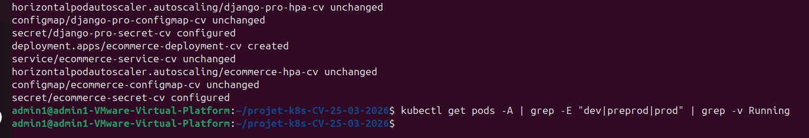

### Dimensionnement des ressources

- CPU requests : 50m/pod → 27 × 50m = 1350m sur 4000m disponibles
- Memory requests : 128Mi/pod

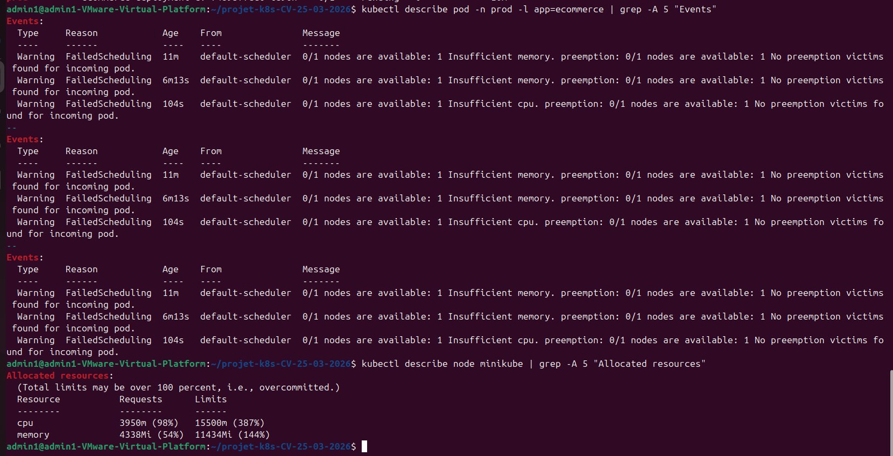

---

## 13. Étape 10 — Test de paiement Stripe

### Catalogue produits

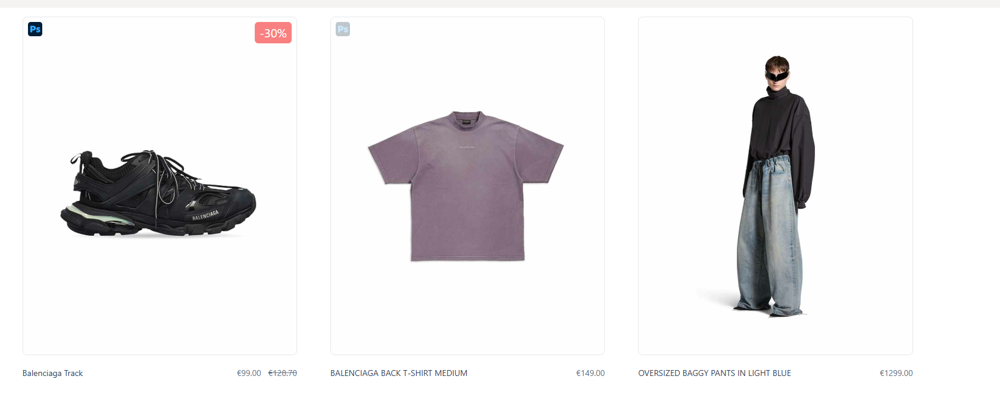

### Checkout Stripe

Données de test : carte `4242 4242 4242 4242`, date future, CVC `123`.

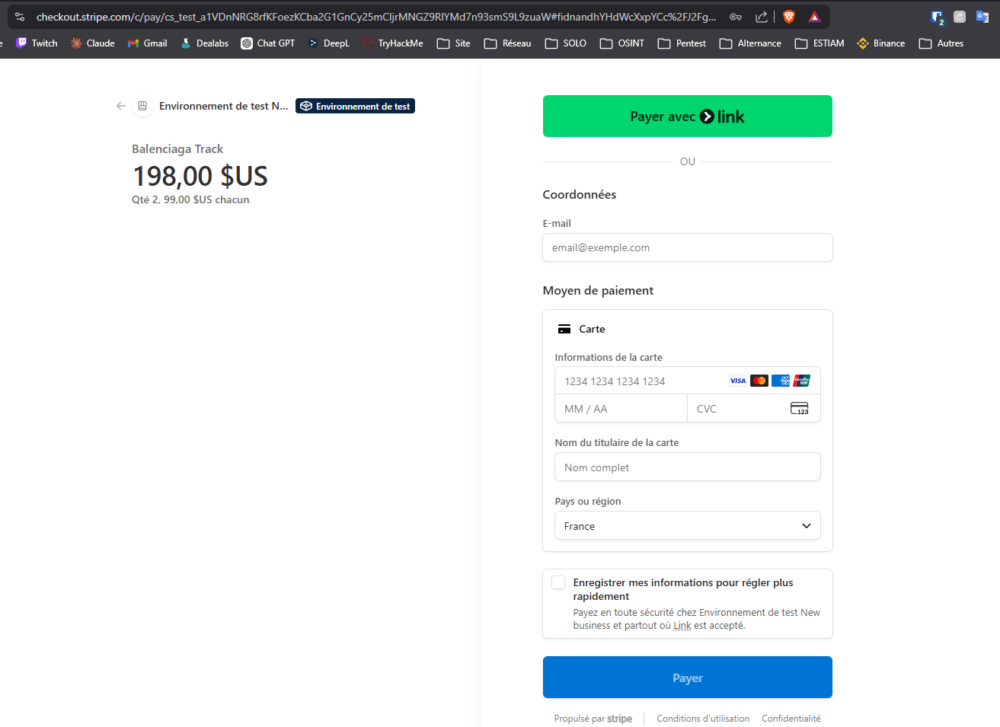

### Paiement réussi

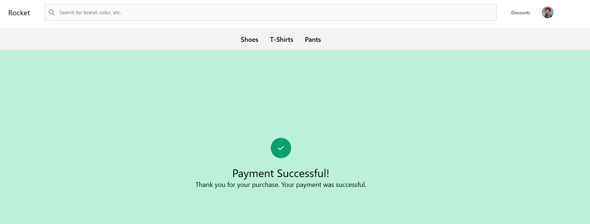

### Vérification dashboard Stripe

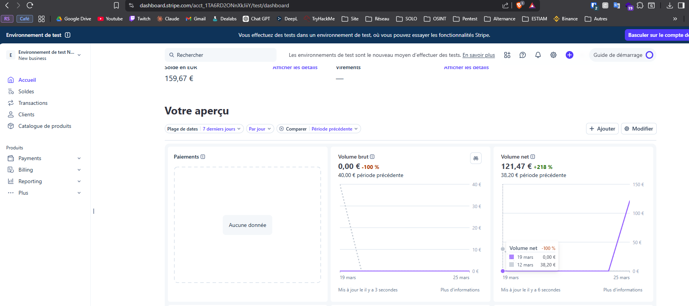

Le paiement apparaît dans le dashboard Stripe, confirmant la communication entre l'app Kubernetes et l'API Stripe.

---

## 14. Étape 11 — Rollout et Rollback

### Build de la v2

Mise à jour de la dépendance Stripe (4.2.0 → 5.0.0) :

```bash
sed -i 's/stripe==4.2.0/stripe==5.0.0/' apps/priv-rocket-ecommerce-main/requirements.txt
docker build -t ecommerce-stripe-cv:2.0 apps/priv-rocket-ecommerce-main/
```


### Rollout v1.0 → v2.0

```bash
kubectl annotate deployment ecommerce-deployment-cv -n dev \
  kubernetes.io/change-cause="v1.0 - version initiale" --overwrite
kubectl set image deployment/ecommerce-deployment-cv \
  ecommerce-stripe=ecommerce-stripe-cv:2.0 -n dev
kubectl annotate deployment ecommerce-deployment-cv -n dev \
  kubernetes.io/change-cause="v2.0 - mise a jour stripe 5.0.0" --overwrite
```

Kubernetes effectue un **rolling update** : les nouveaux pods v2 sont créés progressivement pendant que les pods v1 sont supprimés. Résultat : **zéro downtime**.

### Rollback v2.0 → v1.0

```bash
kubectl rollout undo deployment ecommerce-deployment-cv -n dev --to-revision=3
```

### Preuve — Log complet (`logs/rollout-rollback.log`)

```
=== IMAGE AVANT ROLLOUT ===
    Image:      ecommerce-stripe-cv:1.0

=== IMAGE APRES ROLLOUT ===
    Image:      ecommerce-stripe-cv:2.0

=== IMAGE APRES ROLLBACK ===
    Image:      ecommerce-stripe-cv:1.0

=== HISTORIQUE FINAL ===
REVISION  CHANGE-CAUSE
4         v2.0 - mise a jour stripe 5.0.0
5         v1.0 - version initiale ecommerce stripe
```

Le log prouve les 3 états : v1.0 → v2.0 → retour v1.0 avec zéro downtime.

---

## 15. Étape 12 — Infrastructure as Code avec Kustomize

### Structure

```
infra/
├── ecommerce/
│   ├── base/                    # Manifests communs
│   │   ├── kustomization.yaml
│   │   ├── deployment.yaml
│   │   ├── service.yaml
│   │   └── configmap.yaml
│   └── overlays/
│       ├── dev/                 # NodePort, DEBUG=True
│       ├── preprod/             # LoadBalancer, DEBUG=False, HPA
│       └── prod/                # LoadBalancer, DEBUG=False, HPA
├── django-pro/   (même structure)
└── dashboard/    (même structure)
```

### Déploiement en une commande

```bash
kubectl apply -k infra/ecommerce/overlays/dev
kubectl apply -k infra/ecommerce/overlays/preprod
kubectl apply -k infra/ecommerce/overlays/prod
```

Kustomize assemble automatiquement la base + les patches de l'overlay. Modifier le port de l'app ne nécessite qu'un changement dans la base, propagé à tous les environnements. C'est le principe DRY (Don't Repeat Yourself) appliqué à l'infrastructure.

---

## 16. Étape 13 — Collecte des logs

| Fichier | Contenu |
|---|---|
| `history-projet-CV-25-03-2026.log` | Historique des commandes Linux |
| `docker-logs-ecommerce-CV-25-03-2026.log` | Logs applicatifs ecommerce |
| `docker-logs-django-pro-CV-25-03-2026.log` | Logs applicatifs Django Pro |
| `docker-logs-dashboard-CV-25-03-2026.log` | Logs applicatifs Dashboard |
| `k8s-events-dev-CV-25-03-2026.log` | Événements K8s namespace dev |
| `k8s-events-preprod-CV-25-03-2026.log` | Événements K8s namespace preprod |
| `k8s-events-prod-CV-25-03-2026.log` | Événements K8s namespace prod |
| `etat-cluster-dev.log` | État des ressources dev |
| `etat-cluster-preprod.log` | État des ressources preprod |
| `etat-cluster-prod.log` | État des ressources prod |
| `rollout-rollback.log` | Preuve rollout/rollback |

---

## 17. Gestion des secrets et sécurité

### GitHub Push Protection

GitHub a bloqué un push contenant une clé Stripe dans un fichier `.env` :

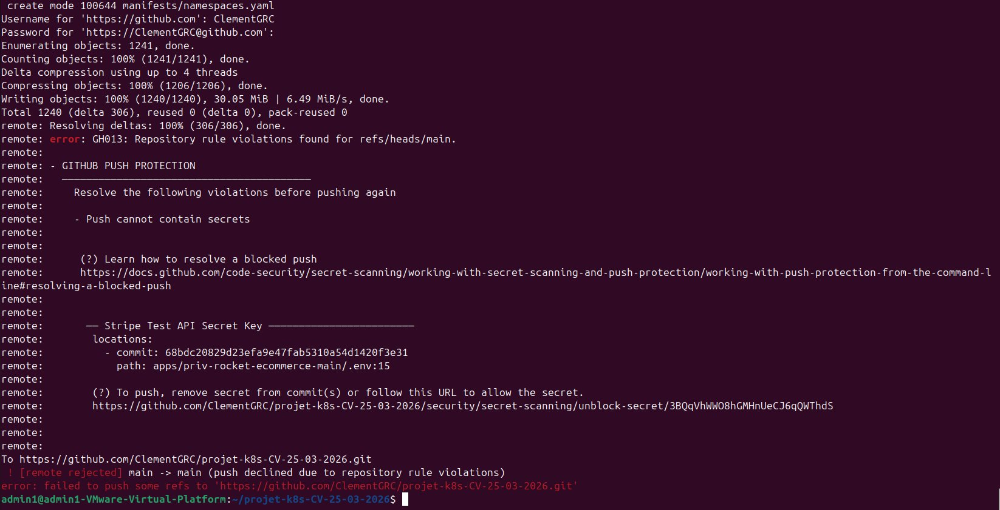

Actions correctives :
1. `.gitignore` excluant `.env` et `*-secret-*.yaml`
2. `git filter-branch` pour nettoyer l'historique
3. Push forcé

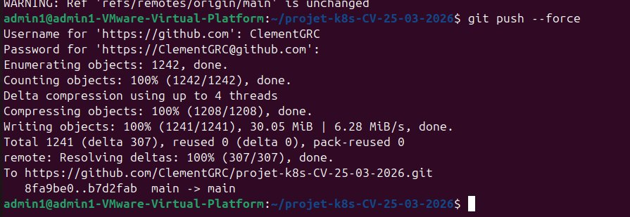

### Bonnes pratiques appliquées
- Fichiers de secrets jamais versionnés dans Git
- Clés Stripe en mode test (préfixe `sk_test_` / `pk_test_`)
- Variables sensibles séparées du code via ConfigMap/Secret
- Historique Git nettoyé après exposition accidentelle

---

## 18. Avantages et inconvénients

### Avantages

| Solution | Avantage |
|---|---|
| Minikube | Simple, simule un vrai cluster k8s, gratuit |
| Docker Hub | Registry accessible publiquement, standard de l'industrie |
| Multi-stage build | Images 3 à 5× plus légères |
| Kustomize | Natif kubectl, élimine la duplication |
| HPA | Scaling automatique sur pics de trafic |
| ConfigMap + Secret | Séparation config / secrets / code |

### Inconvénients

| Solution | Inconvénient |
|---|---|
| Minikube | Single node, pas de haute disponibilité |
| Docker Hub (gratuit) | Limite de pulls, images publiques par défaut |
| LoadBalancer Minikube | IP `<pending>`, nécessite port-forward |
| Secrets K8s natifs | base64 ≠ chiffrement réel |

### Alternatives

| Aspect | Actuel | Alternative |
|---|---|---|
| Cluster | Minikube | Kind, K3S, GKE, EKS, AKS |
| Registry | Docker Hub | GitHub Container Registry, Harbor |
| Templating | Kustomize | Helm Charts |
| Secrets | K8s Secrets | Infisical, Vault |
| CI/CD | Manuel | ArgoCD, FluxCD |

---

## 19. Problèmes rencontrés et solutions

| Problème | Cause | Solution |
|---|---|---|
| GitHub Push Protection | Clé Stripe dans `.env` versionné | `.gitignore` + `git filter-branch` |
| Noms K8s refusés | Majuscules dans `CV` | Convention `cv` minuscules (RFC 1123) |
| Pods en Pending | RAM/CPU insuffisants | VM 8 Go, requests CPU 50m |
| `npm: not found` | Node.js absent de python:slim | Multi-stage avec `node:18-slim` |
| `stripe==4.3.0` inexistant | Version invalide | Changé en `stripe==5.0.0` |
| Rollback échoue | Révision 1 expirée | Vérifié `rollout history` → bonne révision |
| `*.log` dans .gitignore | Logs projet ignorés | Retiré `*.log` du `.gitignore` |

---

## 20. Conclusion

Ce projet a mis en pratique l'ensemble de la chaîne de déploiement Kubernetes :

- **Conteneurisation** : images Docker optimisées avec multi-stage builds, réduction de 77% en taille moyenne
- **Registry** : images publiées sur Docker Hub (`clemgrc/`), accessibles publiquement
- **Orchestration** : 27 pods sur 3 environnements avec 3 réplicas par application
- **Scaling** : HPA en preprod et prod (min 3, max 10 pods, seuil CPU 50%)
- **Paiement** : intégration Stripe validée de bout en bout
- **Mise à jour** : rollout v1→v2 et rollback v2→v1 avec zéro downtime
- **Infrastructure as code** : Kustomize avec base commune et overlays par environnement
- **Sécurité** : secrets séparés du code, GitHub Push Protection, nettoyage d'historique
- **Traçabilité** : repo Git avec commits réguliers, logs collectés

Le POC démontre qu'un cluster Kubernetes peut gérer efficacement plusieurs applications e-commerce conteneurisées avec mise à l'échelle automatique, système de mise à jour/rollback, et séparation propre des environnements — le tout déployé de façon déclarative et reproductible.
